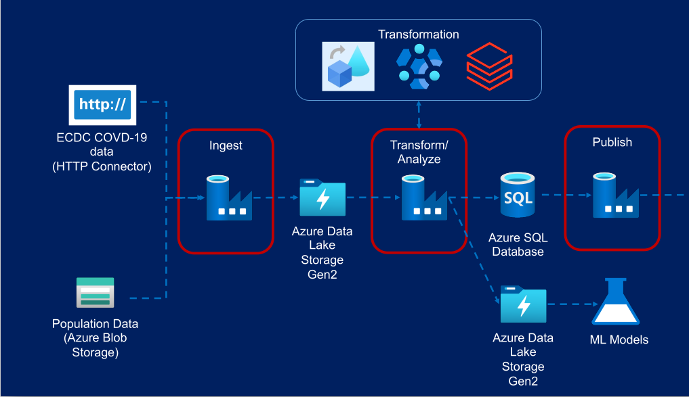
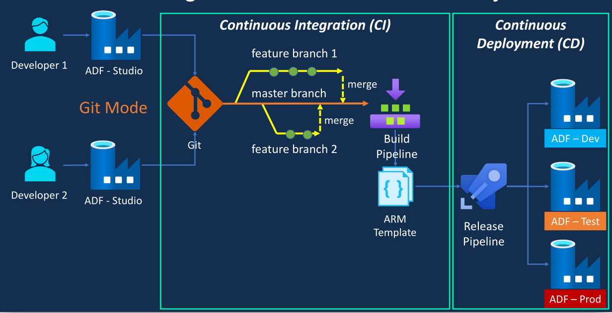

# Introduction 

The project utilizes Azure Data Factory to orchestrate data pipelines for Covid19 data from multiple sources. Data transformations are performed using Azure Databricks, Dataflow, and Azure HDInsight. CI/CD pipeline and releases are created using Azure Devops.

# Architecture

# Transformation

Data transformations logic can be found in dataflow, databricks_trans, and sql_trans for Dataflow, Azure Databricks, and Azure HDInsight, respectively.

# CI/CD

